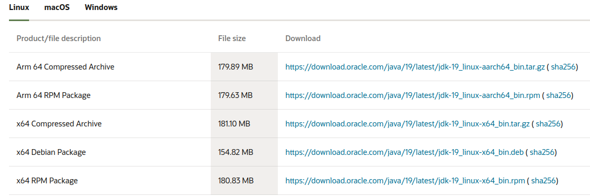
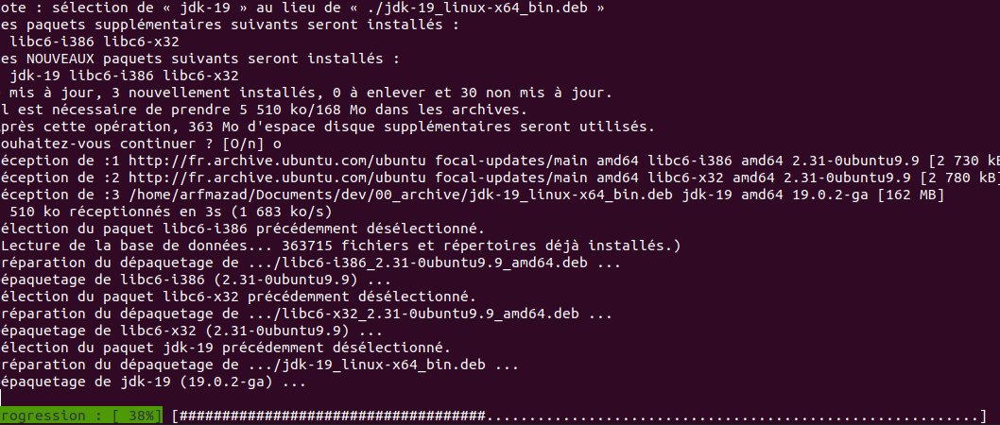
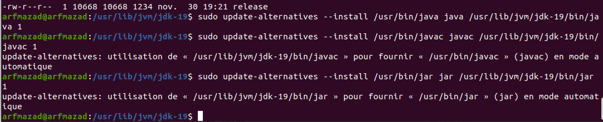
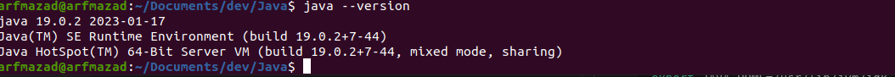
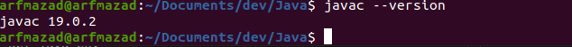

# Installation

[téléchargement](https://www.oracle.com/java/technologies/downloads/#java19)




création du répertoire lib

```sh
sudo mkdir -p /usr/lib/jvm
```

??? ca ne marche pas ..cette étape

```sh
sudo tar -zxf /home/arfmazad/Téléchargements/jdk-19_linux-aarch64_bin.tar.gz -C /usr/lib/jvm/
```

lien symbolique vers les exécutables

```sh
sudo update-alternatives --install /usr/bin/java java /usr/lib/jvm/jdk-19/bin/java 1
```

```sh
sudo update-alternatives --install /usr/bin/javac javac /usr/lib/jvm/jdk-19/bin/javac 1
```

```sh
sudo update-alternatives --install /usr/bin/jar jar /usr/lib/jvm/jdk-19/bin/jar 1
```



Selectionner la version parmis les version installé

```sh
sudo update-alternatives --config java
```

```sh
sudo update-alternatives --config javac
```

```sh
sudo update-alternatives --config jar
```

controle de version

```sh
java -version
```



```sh
javac -version
```



Set java env

```sh
export JAVA_HOME=/usr/lib/jvm/jdk-19
```

setenv JAVA_HOME=/usr/lib/jvm/jdk-19

edit config

```sh
sudo gedit /etc/profile.d/jdk.sh
```

```sh
export J2SDKDIR=/usr/lib/jvm/jdk-19
export J2REDIR=/usr/lib/jvm/jdk-19
export PATH=$PATH:/usr/lib/jvm/jdk-19/bin:/usr/lib/jvm/jdk-19/db/bin
export JAVA_HOME=/usr/lib/jvm/jdk-19
export DERBY_HOME=/usr/lib/jvm/jdk-19/db
```

```sh
sudo gedit /etc/profile.d/jdk.csh
```

```sh
setenv J2SDKDIR /usr/lib/jvm/jdk-19
setenv J2REDIR /usr/lib/jvm/jdk-19
setenv PATH ${PATH}:/usr/lib/jvm/jdk-19/bin:/usr/lib/jvm/jdk-19/db/bin
setenv JAVA_HOME /usr/lib/jvm/jdk-19
setenv DERBY_HOME /usr/lib/jvm/jdk-19/db
```

rendre exécutable les 2 shell

```sh
sudo chmod +x /etc/profile.d/jdk.csh /etc/profile.d/jdk.sh
```
